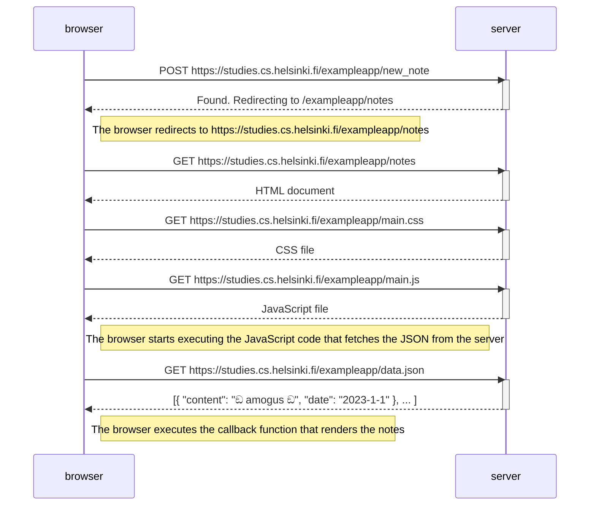

```mermaid
	sequenceDiagram
		participant browser
		participant server

		browser->>server: POST https://studies.cs.helsinki.fi/exampleapp/new_note
		activate server
		server-->>browser: Found. Redirecting to /exampleapp/notes
		deactivate server

		Note right of browser: The browser redirects to https://studies.cs.helsinki.fi/exampleapp/notes

		browser->>server: GET https://studies.cs.helsinki.fi/exampleapp/notes
		activate server
		server-->>browser: HTML document
		deactivate server

		browser->>server: GET https://studies.cs.helsinki.fi/exampleapp/main.css
		activate server
		server-->>browser: CSS file
		deactivate server

		browser->>server: GET https://studies.cs.helsinki.fi/exampleapp/main.js
		activate server
		server-->>browser: JavaScript file
		deactivate server

		Note right of browser: The browser starts executing the JavaScript code that fetches the JSON from the server

		browser->>server: GET https://studies.cs.helsinki.fi/exampleapp/data.json
		activate server
		server-->>browser: [{ "content": "ඞ amogus ඞ", "date": "2023-1-1" }, ... ]
		deactivate server

		Note right of browser: The browser executes the callback function that renders the notes
```
